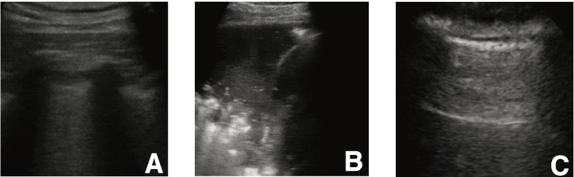

# Goal

The goal of this repository is to replicate and improve the findings of [this](https://github.com/jannisborn/covid19_pocus_ultrasound) repository.

## What is the problem?

The world is facing an unprecedented crisis due to the **COVID-19** pandemic. Being able to test patients for COVID rapidly is crucial to all containment efforts. However, not all countries and municipalities have the resources to rapidly test all patients, especially when the healthcare system is overwhelmed with patients, e.g., during a significant spike in coronavirus cases.

Therefore, **imaging has been proposed as a way to complement existing methods for COVID testing**, especially **in “low-resource” situations** [3]. 

Ultrasound, in particular, is appealing because ultrasound scanners are cheap, portable, readily available, and do not expose the patient to radiation the way that X-ray or CT imaging does [3]. Therefore, there is a demand for **automated classification of ultrasound images for the purpose of diagnosing COVID-19**.

The aim of this project is to accurately classify ultrasound lungs images into **three categories, namely, COVID-19 infected, pneumonia infected, and healthy lungs**.

<p align="center">
	
	<br>
   <em>Example lung ultrasound images. (A): A typical COVID-19 infected lung, showing small subpleural consolidation and pleural irregularities. (B): A pneumonia infected lung, with dynamic air bronchograms surrounded by alveolar consolidation. (C) Healthy lung. 
The lung is normally aerated with horizontal A-lines. Image and caption from Born et. al. 2020 [1]</em>
</p>

### Why would deep learning solve this?
Deep learning has emerged in recent years as one of the best ways to classify images, as long as there is enough training data. Fortunately (or unfortunately, depending on your perspective), the number of training images for COVID is currently growing as the pandemic continues to spread. Therefore, **a deep learning based approach not only has the potential to be effective but would also become more promising in terms of classification performance as time goes on since more training data will become available**. 

## Dataset
### Source of the Dataset

We will be using the dataset provided by the authors of the original **POCOVID-Net paper**. This dataset is freely available on GitHub [3].

### Description of the Dataset

* The dataset consists of images (obtained from videos) which are labeled into the following three categories
    - COVID-19 infected
    - Pneumonia infected
    - Healthy
* The images and videos are recorded by an ultrasound transducer, also called a probe, which is a device that produces sound waves that bounce off body tissues and make echoes.
* The linear probe is a higher frequency probe yielding more superficial images.
* Depending on the type of probe, there are two types of data (*paraphrased from the authors* [3])
  1. **Convex Probe**
     - 162 videos (46x COVID, 49x bacterial pneumonia, 64x healthy, 3x viral pneumonia)
     - 20 videos from the Butterfly dataset (18 COVID, 2 healthy, see below how to use the provided scripts to process the data)
     - 53 images (18x COVID, 20x bacterial pneumonia, 15x healthy)
  2. **Linear Probe**
     - 20 videos (6x COVID, 2x bacterial pneumonia, 9x healthy, 3x viral pneumonia)
     - 6 images (4x COVID, 2x bacterial pneumonia)
     - 45 videos of possible COVID-19 patients collected in Piacenza at the peak of the crisis in Italy; there were not enough PCR tests available, so the label is not clear. For more information and comments by medical experts, see the [metadata sheet](https://docs.google.com/spreadsheets/d/1t-tLMjMod6W-nAjkuxmO0CLsiyalFIOp92k_XD_yeo8/edit#gid=1181682638) or [metadata csv](https://github.com/jannisborn/covid19_pocus_ultrasound/blob/master/data/dataset_metadata.csv).

## Usage

### Initial Setup
* Clone the repository to your local machine

```bash
git clone https://github.com/ar-ambuj23/covid19_pocus_ultrasound_pytorch.git
```
* Install the requirements using

```bash
pip install -r requirements.txt
```

### Data Creation
* The repository will come with most of the data required for training however to replicate the results in our project, additional data must be manually downloaded from **Butterfly**.
  - Navigate to [this](https://www.butterflynetwork.com/covid19/covid-19-ultrasound-gallery) link and scroll to the bottom of the page and click **Download Videos**.

* Place this zipped folder in **code/data** folder and the run the following

```bash
. parse_butterfly.sh
```
- This will unzip the butterfly data folder, process the butterfly video files, organize the data set, and split it into 5 folds for cross-validation. After running successfully, a new directory named **cross_validation** should be created in **/code/data** location.


### To train a new model
* Run this command from the **code** folder
```python
python scripts/train.py [--data_dir DATA_DIR] [--model_name MODEL_NAME] [--model_save_dir MODEL_SAVE_DIR] [--fold FOLD] [--learning_rate LEARNING_RATE] [--epochs EPOCHS] [--batch_size BATCH_SIZE] [--img_width IMG_WIDTH] [--img_height IMG_HEIGHT]
```

### Results
* Navigate to **code/scripts/{model}_trained.ipynb** to see the results of different models.

## Contributing
Pull requests are welcome. For major changes, please open an issue first to discuss what you would like to change.


## Citation

**This work has been inspired by the following references**
1. Born, J., Brändle, G., Cossio, M., Disdier, M., Goulet, J., Roulin, J. and Wiedemann, N., 2020. POCOVID-Net: automatic detection of COVID-19 from a new lung ultrasound imaging dataset (POCUS). arXiv preprint arXiv:2004.12084. [https://arxiv.org/abs/2004.12084](https://arxiv.org/abs/2004.12084)
2. Born, J., Wiedemann, N., Brändle, G., Buhre, C., Rieck, B. and Borgwardt, K., 2020. Accelerating COVID-19 Differential Diagnosis with Explainable Ultrasound Image Analysis. arXiv preprint arXiv:2009.06116. [https://arxiv.org/abs/2009.06116](https://arxiv.org/abs/2009.06116)
3. [https://github.com/jannisborn/covid19_pocus_ultrasound](https://github.com/jannisborn/covid19_pocus_ultrasound)
